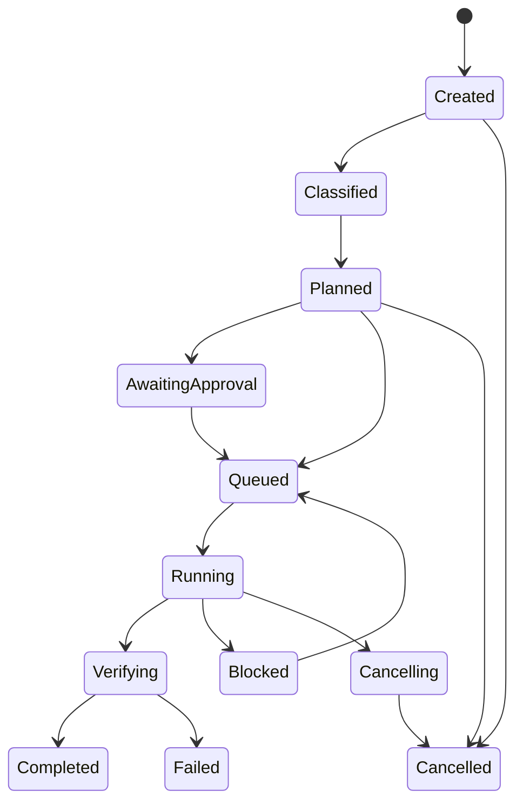

# Control Kernel and Task Lifecycle

## Kernel responsibility

The Control Kernel is Okal's only authority for:

- accepting and binding operator intent;
- creating and transitioning durable tasks;
- approving plans and capability requests;
- selecting and revoking capabilities;
- committing governed memory;
- interpreting execution evidence;
- declaring a governed result.

It does not perform OCR, browse, edit code, render media, or contain provider SDKs.

## Canonical state machine

Terminal states are `Completed`, `Failed`, and `Cancelled`. `Blocked` is not a
failure; it records a missing approval, unavailable dependency, unresolved user
choice, policy denial, or external precondition.

## Task envelope

Every task contains:

- stable task and session identifiers;
- operator and device identity;
- original request bytes and content hash;
- interpreted intent with confidence and open questions;
- privacy, risk, cost, and latency constraints;
- plan version and approval bindings;
- capability and model candidates;
- workspace and memory scopes;
- durable deadlines, retries, cancellation, and budget;
- child-task and dependency relationships;
- evidence receipt references;
- governed result status.

## Plan model

A plan is a versioned directed acyclic graph of steps. Each step declares:

- desired outcome and acceptance check;
- capability class, not just a hard-coded provider;
- typed inputs and expected outputs;
- required permissions and secrets;
- risk tier and approval requirement;
- resource budget and deadline;
- retry and compensation behavior;
- verification method;
- evidence required for completion.

Changing an approved consequential step invalidates the affected approval.

## Risk tiers

| Tier | Examples | Default behavior |
|---|---|---|
| R0 | Read local approved data, calculate, summarize | Auto-run within scope |
| R1 | Reversible local writes in a task workspace | Auto-run when policy allows; preserve diff |
| R2 | External writes, messages, PR reviews, account changes | Exact action approval or narrow standing grant |
| R3 | Destructive, financial, legal, credential, security-sensitive action | Always explicit; additional verifier; no silent retry |

Risk classification is deterministic where possible and conservative on
ambiguity. A model may propose a tier but cannot lower it.

## Execution semantics

The system keeps separate fields for:

- invocation attempted;
- provider reached;
- execution started;
- execution completed;
- output present;
- native output verified;
- model output present;
- acceptance checks passed;
- policy accepted result;
- governed success.

These states must never collapse into one `success: true` flag.

## Retry and compensation

- Read-only idempotent steps may retry automatically within budget.
- Writes require an idempotency key and postcondition verification.
- Non-idempotent consequential actions do not retry without a verified provider state.
- Compensation is explicit; it is never assumed to be possible.
- A resumed workflow reuses evidence only when request, execution, capability,
  environment, and output bindings still match.

## Cancellation

Cancellation revokes active grants, stops dispatch, requests worker termination,
records incomplete steps, and preserves produced evidence. A task is not marked
cancelled until active consequential work is reconciled or reported unknown.

## Governed completion

A task reaches `Completed` only when required steps have accepted receipts and
the final result is bound to those receipts. Partial completion must identify
completed, failed, unavailable, and unattempted outputs explicitly.
