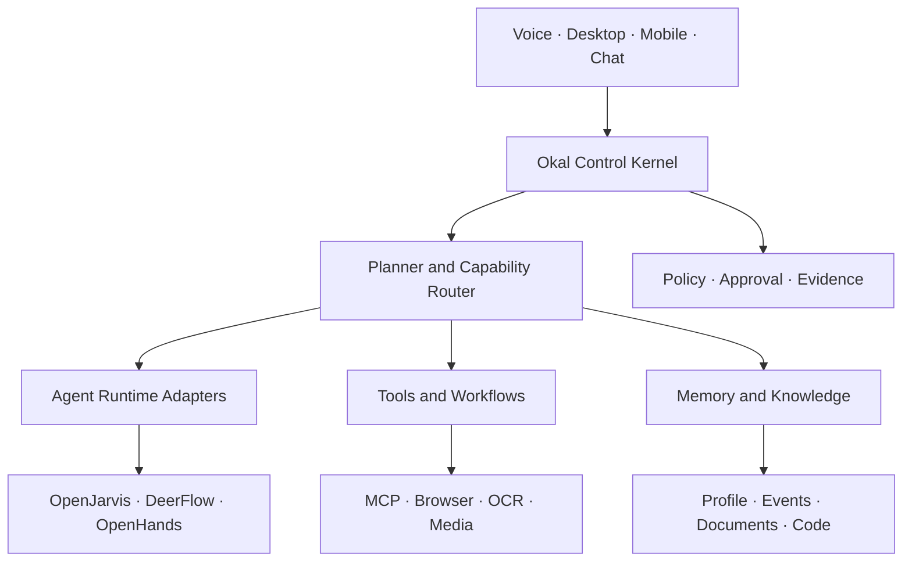

# Okal Project Wiki

> **Okal is a verified, resource-aware personal AI operating system.** It
> provides one operator with a unified identity, memory, policy boundary,
> evidence ledger, and capability fabric while delegating work to replaceable
> models, tools, workflows, and specialist agents.

## Why Okal exists

Personal AI projects usually optimize one surface: chat, voice, browser use,
coding, memory, automation, or long-running agents. Combining those projects
directly creates duplicate orchestrators, incompatible memories, excessive
privilege, unclear truth semantics, and a system that cannot be upgraded safely.

Okal solves the integration problem at the control-plane level:

1. A small **Control Kernel** owns identity, policy, task state, and authority.
2. A **Capability Fabric** discovers and invokes tools, skills, workflows,
   models, and agents through typed adapters.
3. A **Memory Fabric** separates source events from derived facts and preserves
   provenance, time, sensitivity, and correction history.
4. A **Trust Gate** scans, tests, approves, signs, and pins every capability.
5. A **Resource Broker** schedules CPU, RAM, GPU, network, latency, and cost.
6. An **Evidence Ledger** binds every governed result to its execution evidence.

## Canonical product promise

Okal should be able to receive a request in natural language, establish the
user's intent and risk boundary, build a visible plan, choose the best available
capabilities, execute inside governed environments, verify the outcome, return
evidence, and retain only approved memory.

The target showcase is:

> “Hey Okal, review the new pull request, relate it to the Jira work, inspect the
> Arabic requirements document, run the tests in a sandbox, explain the risks,
> prepare a team message, ask before sending it, and remember my final decision.”

## Documentation map

### Product

- [Project Vision and Principles](Project-Vision-and-Principles)
- [Scope and Product Requirements](Scope-and-Product-Requirements)
- [Personas and End-to-End Use Cases](Personas-and-End-to-End-Use-Cases)
- [MVP Definition](MVP-Definition)

### Architecture

- [System Architecture](System-Architecture)
- [Control Kernel and Task Lifecycle](Control-Kernel-and-Task-Lifecycle)
- [Capability Fabric and Manifest](Capability-Fabric-and-Manifest)
- [Agent Runtime Adapters](Agent-Runtime-Adapters)
- [Model Gateway and Routing](Model-Gateway-and-Routing)
- [Memory and Context Architecture](Memory-and-Context-Architecture)
- [Data Model, APIs, and Protocols](Data-Model-APIs-and-Protocols)

### Capabilities

- [Knowledge and Document Intelligence](Knowledge-and-Document-Intelligence)
- [Voice and Multimodal Experience](Voice-and-Multimodal-Experience)
- [Browser, Desktop, and Coding Actions](Browser-Desktop-and-Coding-Actions)
- [Automation, Channels, and Integrations](Automation-Channels-and-Integrations)

### Trust and quality

- [Security and Threat Model](Security-and-Threat-Model)
- [Skill Supply Chain](Skill-Supply-Chain)
- [Identity, Secrets, and Permissions](Identity-Secrets-and-Permissions)
- [Sandboxing and Execution Isolation](Sandboxing-and-Execution-Isolation)
- [Evidence Receipts and Observability](Evidence-Receipts-and-Observability)
- [Evaluation and Benchmarking](Evaluation-and-Benchmarking)
- [Testing and Quality Gates](Testing-and-Quality-Gates)

### Delivery

- [Deployment and Operations](Deployment-and-Operations)
- [Resource and GPU Scheduling](Resource-and-GPU-Scheduling)
- [Roadmap and Release Plan](Roadmap-and-Release-Plan)
- [Initial Backlog](Initial-Backlog)
- [Delivery Workflow and Contributing](Delivery-Workflow-and-Contributing)
- [Risk Register](Risk-Register)
- [Research and Market Differentiation](Research-and-Market-Differentiation)
- [Dependency Selection and Licensing](Dependency-Selection-and-Licensing)
- [Architecture Decision Records](Architecture-Decision-Records)

## Current phase

The current phase is **M0 — Architecture and Proof Foundation**. Implementation
must not begin by integrating external agents. The first executable slice is the
task envelope, policy decision, sandboxed test capability, and evidence receipt.

## Definition of project success

Okal succeeds when it is demonstrably more trustworthy and useful than running
the same upstream agents independently. Success is measured through verified
task completion, safe-action rate, memory accuracy, recovery, resource use,
latency, and operator trust—not by the number of installed tools.
