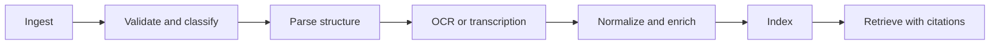

# Knowledge and Document Intelligence

## Goal

Convert documents, images, audio, repositories, and selected web content into
source-grounded knowledge that can be retrieved and cited without losing layout,
page, region, speaker, or version provenance.

## Pipeline

## Component roles

- **Docling** is the preferred structural parser for PDF, Word, PowerPoint,
  spreadsheets, HTML, images, and supported audio/text formats.
- **Unlimited OCR** is an on-demand specialist for difficult scanned or long
  visual documents; it is not loaded continuously.
- **Whisper through Voicebox** is an initial transcription provider.
- **codebase-memory-mcp** is dedicated to source-code structure and symbols.
- A web acquisition adapter stores URL, retrieval time, content digest, and
  extraction method before content is used.

## Artifact rules

- Hash the original bytes before parsing.
- Preserve original file name separately from the content address.
- Detect MIME type from content, not extension alone.
- Apply size, page, decompression, and archive-depth limits.
- Treat macros, scripts, links, embedded files, and instructions as untrusted.
- Never execute document content during ingestion.
- Record parser/model version and configuration.

## Normalized document model

A document contains pages or time ranges, ordered blocks, headings, paragraphs,
tables, code, equations, figures, captions, lists, footnotes, and metadata. Each
block links to source coordinates or timestamps and may have language, confidence,
and sensitivity labels.

## OCR routing

Use native text extraction first. Invoke OCR for image-only or low-confidence
regions. High-cost visual models operate on selected pages unless the task
requires full-document processing. The Resource Broker grants exclusive or
bounded GPU access.

## Chunking and retrieval

Chunking follows document structure rather than fixed character windows. Parent
and child relationships are preserved. Retrieval combines exact identifiers,
full-text search, embeddings, and metadata filters. Answers cite the smallest
source span that supports the claim.

## Arabic and bilingual acceptance

The evaluation set includes Arabic RTL documents, Arabic-English mixed pages,
tables, numbers, diacritics, scanned pages, and text with technical English
identifiers. Rendering order and citation location must be verified separately
from semantic answer quality.

## Security boundary

Retrieved content is data, not authority. Prompt injection labels survive
storage and retrieval. Instructions found in a PDF, issue, email, or website
cannot grant tools, change policy, or request secrets.

## MVP acceptance

- Ingest PDF, DOCX, image, and Markdown.
- Preserve artifact hash and page/block provenance.
- Answer from an Arabic requirements document with citations.
- Refuse unsupported claims when retrieval evidence is absent.
- Resume a partially processed document without duplicate records.
- Delete a document and remove its derived indexes.
