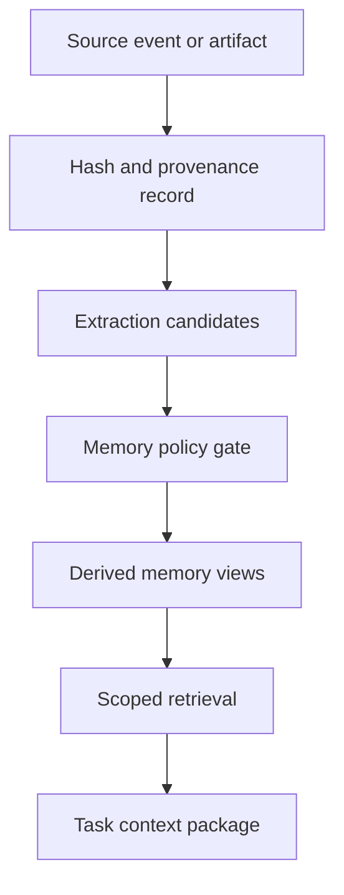

# Memory and Context Architecture

## Memory is governed state

Okal does not treat a vector database or conversation transcript as “memory.”
Memory is a governed lifecycle that distinguishes original evidence from derived
representations and controls who may retrieve, change, export, or delete them.

## Memory layers

| Layer | Purpose | Initial storage |
|---|---|---|
| Working context | Current turn, plan, active evidence, scratch values | Task state and bounded cache |
| Event memory | Immutable interactions, actions, observations, and receipts | Append-only relational records |
| Profile memory | Stable preferences, identity facts, recurring constraints | Versioned structured records |
| Episodic memory | Past situations, decisions, outcomes, and lessons | Structured episodes plus embeddings |
| Semantic memory | Concepts, entities, relationships, and changing facts | Relational/vector first; Graphiti later |
| Procedural memory | Approved skills, workflows, and successful patterns | Capability registry and versioned files |
| Document knowledge | Source-grounded chunks, tables, figures, and citations | Artifact store plus retrieval index |
| Code memory | Symbols, dependencies, architecture, and repository history | codebase-memory-mcp adapter |

## Source and derived separation

Source content is not overwritten by a summary. Derived facts link to one or
more source spans and record the extractor version and confidence.

## Memory write protocol

1. A worker proposes a candidate memory with purpose and scope.
2. The kernel validates schema, provenance, sensitivity, and source availability.
3. Deduplication and contradiction detection run.
4. Retention, encryption, visibility, and consent policy are evaluated.
5. The candidate is accepted, rejected, merged, or held for review.
6. The decision and resulting version are recorded in an evidence receipt.

No agent writes durable memory directly.

## Temporal truth

Facts include valid time and transaction time. Replacing “the current project
deadline is X” with “the deadline is Y” invalidates the former current view but
preserves that it was previously believed, why it changed, and its source.

Graphiti is a candidate temporal graph provider after the simpler source-grounded
relational implementation passes MVP evaluation. It is not required for early
correctness.

## Retrieval policy

Retrieval filters and ranks by:

- operator, project, session, device, and purpose scope;
- sensitivity and recipient boundary;
- source trust and provenance completeness;
- temporal validity and recency;
- semantic, keyword, graph, and exact identifier relevance;
- previous retrieval usefulness;
- token and latency budget.

The context builder records which memories influenced a model call. Sensitive
memory is never injected into a remote model without an allowed route.

## Conflict handling

- Contradictory facts remain separate until resolved.
- Higher confidence does not erase lower-confidence source records.
- User correction creates a new authoritative version and links the superseded one.
- Model-generated guesses cannot silently become profile facts.
- Missing source or extractor failure produces `UNVERIFIED_MEMORY_CANDIDATE`.

## Forgetting and deletion

The operator can inspect, correct, expire, export, and delete memory. Deletion
propagates to derived views and indexes. Evidence required for system integrity
retains a tombstoned minimal record without retaining deleted content, subject to
the configured policy.

## MVP implementation

- SQLite development profile and PostgreSQL shared profile.
- Full-text search and optional pgvector.
- Content-addressed local artifacts.
- Structured profile and episode tables.
- No Neo4j requirement.
- Mem0 evaluated behind an adapter; not an authoritative store.
- Graphiti deferred until memory benchmark results justify the cost.

## Memory quality metrics

Precision, recall, contradiction rate, unsupported-fact rate, source-link
coverage, stale-memory rate, sensitive retrieval violations, correction latency,
and retrieval usefulness are release metrics.
