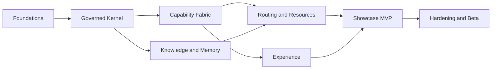

# Roadmap and Release Plan

The roadmap is ordered by evidence and dependency, not by feature excitement. Dates are assigned only after team capacity and hardware availability are known.

## Delivery horizons

| Milestone | Outcome | Exit evidence |
|---|---|---|
| M0 — Foundations | repository, contracts, CI, threat model, local stack | clean build; architecture decisions accepted |
| M1 — Governed Kernel | durable tasks, plans, events, policy, approvals, receipts | denial/retry/resume tests pass |
| M2 — Capability Fabric | manifests, SDK, MCP gateway, sandbox, artifacts | three reference capabilities pass conformance |
| M3 — Knowledge and Memory | documents, Arabic OCR, code index, layered memory | grounded retrieval and deletion evals pass |
| M4 — Model and Resource Routing | local/remote gateway, budgets, GPU broker | constrained-hardware routing suite passes |
| M5 — Experience | web UI, CLI, streaming, push-to-talk voice | accessible end-to-end interaction works |
| M6 — Showcase MVP | GitHub + Arabic PDF + code workflow | release acceptance suite passes |
| M7 — Hardening and Beta | packaging, backup, upgrades, security review | signed beta and rollback exercise pass |

## Recommended sequence

M3 and parts of M5 can proceed in parallel after their contracts stabilize. Integration is continuous; no milestone remains on a long-lived branch.

## Effort guidance

For a focused team of three to five experienced engineers, the MVP is expected to require roughly 16–24 weeks. A solo implementation is more realistically 28–40 weeks. These are planning ranges, not commitments; model availability, security findings, and voice/OCR quality may move them.

## Release train

- `0.x-dev`: frequent internal snapshots, no compatibility promise.
- `0.1-alpha`: kernel and capability contracts usable by contributors.
- `0.2-alpha`: complete showcase in controlled fixtures.
- `0.3-beta`: clean installation, real integrations, security and restore tested.
- `1.0`: stable public contracts, migration policy, documented support boundary.

Every release is cut from reviewed main, tagged, signed, reproducibly built, evaluated, and accompanied by rollback instructions.

## Post-MVP themes

1. Additional channels and automation adapters.
2. Desktop interaction with structured-first control and bounded visual fallback.
3. Remote worker pools and richer A2A interoperability.
4. Gated skill marketplace and community trust signals.
5. Advanced temporal memory and personal knowledge graph.
6. Video/media labs using isolated optional components.
7. Research releases for evidence-aware routing and capability governance.

## Explicit deferments

The following do not enter the roadmap until the MVP evidence is stable: multi-tenant hosting, open-ended autonomous operation, automatic production self-improvement, broad smart-home control, financial execution, and unbounded browser/desktop authority.

## Milestone governance

At each milestone review, the team examines acceptance evidence, failure clusters, updated threats, license changes, resource budgets, and user corrections. A milestone is not closed by code completion alone.

