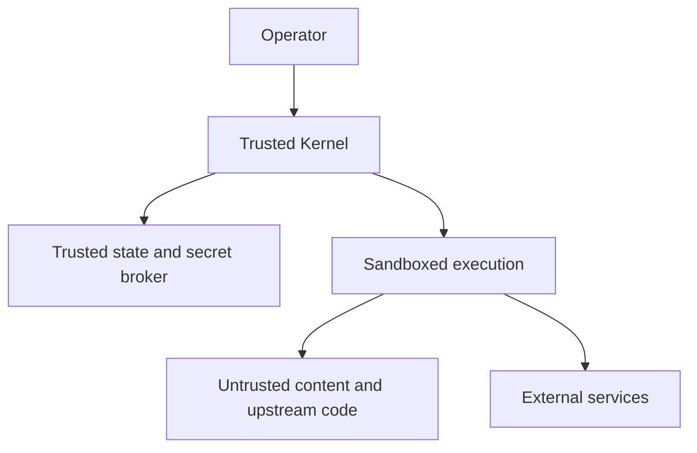

# Security and Threat Model

## Security objective

Protect the operator, data, accounts, devices, and external parties from both
malicious inputs and capable-but-fallible agents. The system assumes that model
output, retrieved content, community skills, upstream packages, and remote
services may be incorrect or adversarial.

## Protected assets

- operator identity, preferences, and memory;
- credentials, tokens, keys, cookies, and session state;
- local files, repositories, documents, microphone, camera, and screen;
- external accounts, communications, money, and reputation;
- task plans, policy decisions, receipts, logs, and artifacts;
- capability registry, signing keys, and release pipeline.

## Trust zones

The kernel and its stores are trusted to enforce contracts. Models, workers,
tools, content, and external responses are untrusted until validated.

## Primary threats

| Threat | Example | Core controls |
|---|---|---|
| Prompt injection | Web page asks the agent to reveal secrets | Data/instruction separation, taint labels, deny-by-default grants |
| Tool poisoning | MCP schema misrepresents a destructive operation | Pinning, scan, conformance, side-effect classification |
| Skill supply-chain attack | Install script exfiltrates files | Quarantine, SBOM, static/semantic scan, isolated tests |
| Memory poisoning | Untrusted claim becomes durable profile fact | Provenance gate, contradiction handling, approval |
| Secret exfiltration | Model or tool sends tokens externally | Handle-based injection, egress policy, redaction |
| Privilege escalation | Worker requests host home or Docker socket | Fixed sandbox profiles, kernel-only grants |
| Confused deputy | Low-risk task invokes high-risk connector | Purpose-bound grants and policy evaluation |
| False success | Agent claims tests passed without execution | Evidence receipts and independent verification |
| Replay/substitution | Old receipt is reused for new task/output | Cryptographic request/execution/output bindings |
| Runaway autonomy | Recursive agents consume resources or act widely | Budgets, recursion limits, cancellation, approval |
| SSRF/network escape | Tool reaches metadata/internal services | Destination policy, DNS/IP validation, proxy |
| Artifact attack | Malicious archive or document exploits parser | Size/depth limits, sandboxed ingestion, no execution |
| Dependency compromise | Upstream release changes behavior | Immutable pin, signature/digest, staged upgrade |
| Privacy leakage | Sensitive memory routed to cloud model | Data classification and route policy |

## Security invariants

1. A worker cannot widen its grant.
2. Untrusted content cannot authorize an action.
3. A model cannot lower a deterministic risk tier.
4. Missing policy evaluation denies dispatch.
5. Missing verification denies governed success.
6. Secrets are not placed in model-visible text when a handle can be used.
7. Consequential writes have idempotency and postcondition evidence.
8. Memory writes require provenance and policy acceptance.
9. Revoked capability versions cannot receive new jobs.
10. Audit and evidence records are append-only through application APIs.

## Human approval

Approval binds operator, task, plan version, capability, exact action class,
destination, data summary, expiry, and optional repetition count. Editing a
material field invalidates approval. Standing grants are narrow, inspectable,
revocable, and never apply to R3 actions.

## Incident response

The kill switch revokes active grants, pauses queues, disables external egress,
and preserves evidence. Incidents are classified, contained, investigated,
rotated/revoked, restored from trusted versions, and followed by a regression
test. Sensitive evidence is access-controlled and redacted for reports.

## Security validation

Security releases require threat-model review, dependency and container scans,
prompt-injection tests, capability conformance, secret-canary tests, sandbox
escape checks, policy deny-path tests, and adversarial receipt substitution tests.

This Wiki is a design, not a security certification. Claims become valid only
for the exact release artifact and test evidence referenced by a release.
