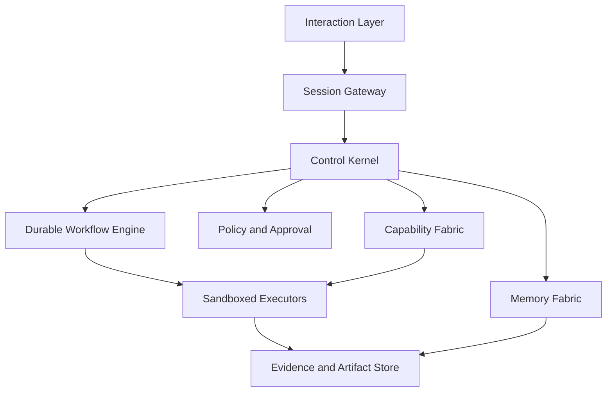

# System Architecture

## Architectural style

Okal uses a **thin authoritative kernel with process-isolated adapters**. The
kernel contains domain contracts and decisions; integrations remain outside it.
The initial deployment is a modular monolith plus workers, not a premature fleet
of independently deployed microservices.



## Logical layers

### 1. Interaction layer

Desktop UI, web UI, CLI, voice session, and channel adapters normalize input
into a `UserIntentEnvelope`. They do not directly invoke tools.

### 2. Session gateway

Owns streaming, conversation-to-task links, device identity, cancellation, and
operator-visible events. OpenClaw may be used as an optional channel gateway,
but Okal remains the session authority.

### 3. Control Kernel

Owns the task state machine, plan, policy requests, capability selection,
memory gates, evidence semantics, and governed result. It contains no UI logic
and no provider-specific client code.

### 4. Durable workflow layer

Executes resumable orchestration. The MVP may implement durability using the
database and an outbox-backed worker queue. Temporal is the preferred later
provider when workflow complexity justifies its operational cost.

### 5. Capability Fabric

Stores immutable versions of models, tools, skills, workflows, services, and
agent adapters. It supports MCP for tools/context, A2A for remote agents, Agent
Skills for procedures, and native contracts for core capabilities.

### 6. Policy, approval, and trust

Evaluates requested grants from declarative policy plus operator decisions. OPA
is the planned external policy evaluator; the kernel owns the policy request and
decision contract.

### 7. Memory and knowledge

Separates raw events/artifacts from derived memory. Retrieval is scoped by task,
purpose, sensitivity, user, project, recency, and provenance.

### 8. Execution plane

Hosts model calls, deterministic tools, browser sessions, code sandboxes, OCR,
voice, media, long-horizon agents, and remote workers. Executors receive a
short-lived grant and cannot write authoritative state directly.

### 9. Evidence and artifacts

Stores append-only execution receipts, hashes, trace identifiers, logs with
redaction, produced files, verification results, and provenance links.

## Initial technology baseline

| Concern | Initial choice | Boundary |
|---|---|---|
| Kernel/API | Python 3.12+, FastAPI, Pydantic | Domain interfaces do not import providers |
| Web UI | TypeScript, React | Consumes versioned API/event contracts |
| Desktop | Tauri when desktop integration begins | Optional shell over the web UI |
| Primary store | PostgreSQL in shared deployments; SQLite dev profile | Repository interfaces hide storage |
| Vector search | pgvector when PostgreSQL is used | Not the source of truth |
| Artifact store | Local content-addressed directory; S3-compatible later | Hash-addressed references |
| Model gateway | LiteLLM adapter; Ollama local provider | No direct provider calls from domain code |
| Policy | Internal policy contract, OPA adapter | Deny on evaluation failure |
| Isolation | Rootless container provider | Stronger VM provider is replaceable |
| Telemetry | OpenTelemetry | Langfuse is an optional AI trace backend |
| Protocols | OpenAPI, SSE/WebSocket, MCP, A2A | Versioned adapters |

## Planned repository layout

```text
okal/
├── apps/
│   ├── api/
│   ├── web/
│   ├── desktop/
│   └── cli/
├── packages/
│   ├── kernel/
│   ├── contracts/
│   ├── policy/
│   ├── evidence/
│   ├── memory/
│   ├── capability-sdk/
│   └── resource-broker/
├── adapters/
│   ├── models/
│   ├── agents/
│   ├── mcp/
│   ├── channels/
│   └── storage/
├── capabilities/
│   ├── builtin/
│   └── fixtures/
├── evals/
├── tests/
├── deploy/
├── docs/
└── wiki/
```

## Dependency rule

Dependencies point inward toward domain contracts. Upstream agents never become
kernel imports. An adapter can be disabled at build or runtime without changing
task, policy, memory, or evidence semantics.

## Failure boundaries

- Model failure cannot corrupt task state.
- Worker failure cannot produce governed success.
- Memory extraction failure cannot delete source events.
- Policy service failure denies new grants.
- Telemetry failure cannot expose secrets or block revocation.
- Optional agent failure falls back only when the plan permits equivalent work.
- External unavailability is recorded separately from execution failure.

## Architecture tests

The build will include import-boundary tests, contract tests for every adapter,
schema compatibility tests, dependency-license checks, and a minimal clean-room
deployment test. Architectural conformance is part of CI, not a documentation-only rule.
