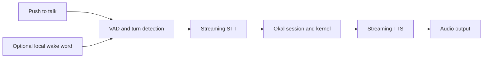

# Voice and Multimodal Experience

## Goal

Provide a responsive, local-first voice interface that can be interrupted,
corrected, inspected in text, and safely connected to governed actions.

## Reference pipeline

## Planned components

- **openWakeWord** as an optional local activation path after push-to-talk is
  reliable, using a project-specific phrase and separately reviewed model.
- **Pipecat** as the preferred real-time audio/multimodal transport pipeline.
- **Voicebox** as the local speech studio and provider layer for Whisper STT,
  multilingual TTS, preset voices, and approved voice cloning.
- Local VAD and turn detection selected through measured Arabic/English latency.

## Interaction behavior

- Push-to-talk is the safe default; any wake-word processing remains local.
- Live transcript is visible and correctable.
- The operator can interrupt speech immediately.
- Okal distinguishes dictation, conversation, and command modes.
- Ambiguous consequential commands require clarification.
- Approval prompts name the exact action, data, and destination.
- A text path is always available when audio fails.

## Voice identity and cloning

Voice samples are sensitive biometric-like data. Importing or recording a sample
requires explicit consent and a declared owner. Cloned voices are restricted to
authorized use, stored encrypted, and never uploaded unless the policy explicitly
permits the selected provider.

## Latency budgets

The fast path prioritizes audio over batch workloads. Target milestones:

- wake-word decision under 250 ms after phrase completion;
- partial transcript visible under 400 ms when the provider permits;
- perceived conversational response under 1.2 s for a simple local/fast route;
- interruption response under 200 ms;
- no GPU-heavy background dispatch that violates an active voice lease.

Targets are measured on reference hardware and may become profile-specific.

## Multimodal input

Screen, camera, image, and audio inputs use the same artifact/provenance system as
documents. Continuous capture is off by default. The UI must show when a sensor
is active and offer an immediate stop control.

## Failure behavior

- Low STT confidence triggers confirmation for high-impact intent.
- Missing or empty transcript is not a valid user request.
- TTS failure falls back to text without replaying the action.
- Network loss does not silently switch a local-only voice session to cloud.
- Audio capture stops when the session is cancelled or permission is revoked.

## MVP scope

The showcase includes push-to-talk, bilingual streaming STT, text-visible
planning, interruption, one local TTS voice, and approval before external
communication. Wake word may be enabled only after the latency and false-trigger
gates pass. Voice cloning and continuous camera vision are post-MVP.
